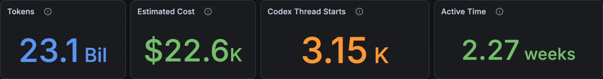
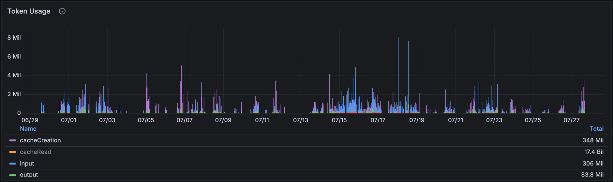
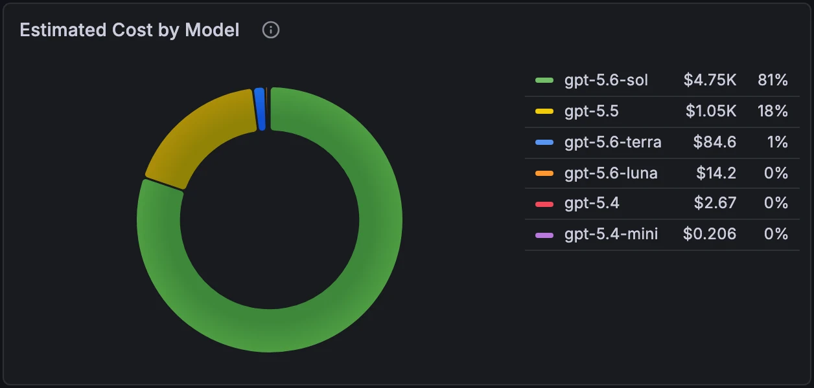
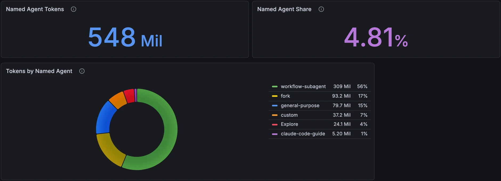

# cc-metrics

Local metrics pipeline for Claude Code, OpenAI Codex CLI, and xAI Grok Build:

```text
Claude Code ─┐
Codex CLI ───┼─ OTLP ─> OpenTelemetry Collector ─> Prometheus ─> Grafana
Grok Build ──┘                                         ^
Codex session ledger ─> ledger exporter (host:9314) ───┘
```

Runs entirely on your machine. Published ports bind to `127.0.0.1` by default;
client authentication stays in each tool, so the stack needs no provider API
key.

Codex token totals are read from the local session ledger, because Codex's
native OTLP metrics structurally undercount. See
[docs/codex-ledger.md](docs/codex-ledger.md).

## Dashboard

One Grafana dashboard, "Token & Usage Monitor", provisioned automatically.

| row | what it answers |
| --- | --- |
| Overview | session starts, tokens, estimated cost, Codex threads, active time, cache hit rate |
| Token Usage | tokens over time, split by type, model, and effort level (both sources) |
| Cost Analysis | estimated cost over time and by model, across supported vendors |
| Agents | tokens and estimated cost for Claude traffic carrying a named agent |
| Sessions & Productivity | commits, pull requests, lines changed, edit decisions |

Cost split by model across vendors is the reason this exists. The figures are
estimates, not invoices; see
[Cost meaning](docs/metrics-contract.md#cost-meaning).









## Requirements

| Component | Supported requirement |
| --- | --- |
| Host | macOS or Ubuntu only |
| Containers | Docker with `docker compose` |
| Claude Code | 2.1.214 or newer for corrected streaming token/cost accounting |
| Codex CLI | 0.145.0 or newer for GPT-5.6 cache-write telemetry |
| Grok Build | 1.0.5 verified; its external OpenTelemetry export is alpha (schema v1) |
| Python | 3.10 or newer for hook installation, pricing maintenance, and tests |
| Git | Needed for cloning and the optional commit metric |
| Password generator | OpenSSL command below, or a password manager |

Version floors are behavioral
([Claude monitoring](https://code.claude.com/docs/en/monitoring-usage),
[Codex 0.145.0 source](https://github.com/openai/codex/blob/rust-v0.145.0/codex-rs/core/src/tasks/mod.rs)).

Install Docker
([macOS](https://docs.docker.com/desktop/setup/install/mac-install/),
[Ubuntu](https://docs.docker.com/engine/install/ubuntu/) plus
`docker-compose-plugin`; the `docker` group grants root-level privileges),
Git, Python, and OpenSSL from trusted sources. Install and authenticate
[Claude Code](https://code.claude.com/docs/en/installation) and
[Codex CLI](https://developers.openai.com/codex/cli/).

```console
docker version
docker compose version
claude --version
codex --version
python3 --version
```

## Setup

### 1. Get the code and fill deployment values

Clone from any parent directory; later commands run from the repository
root.

```console
git clone https://github.com/tokenkraft/cc-metrics.git
cd cc-metrics
cp .env.example .env
```

Create the Grafana administrator password (`umask` keeps it private) and the
ignored runtime directory, then copy the printed paths into `.env`:

```sh
(umask 077 && mkdir -p .secrets \
  && openssl rand -base64 24 > .secrets/grafana_admin_password.txt)
runtime_directory="$(pwd -P)/runtime"
mkdir -p "$runtime_directory"
printf 'CC_METRICS_RUNTIME_DIR=%s\n' "$runtime_directory"
printf 'GRAFANA_ADMIN_PASSWORD_FILE=%s\n' "$(pwd -P)/.secrets/grafana_admin_password.txt"
```

Review every `.env` entry; `HOST_ENV` and `CC_METRICS_RUNTIME_DIR` ship blank
and are required.

| Variable | User input |
| --- | --- |
| `GRAFANA_ADMIN_PASSWORD_FILE` | Host path to password file |
| `CC_METRICS_RUNTIME_DIR` | Absolute local runtime directory |
| `HOST_ENV` | Non-sensitive deployment label |
| `HOST_BIND_ADDRESS` | Listener interface; keep `127.0.0.1` for same-host use |
| `GRAFANA_PORT` | Unused host port for Grafana |
| `PROMETHEUS_PORT` | Unused host port for Prometheus |
| `OTLP_GRPC_PORT` | Unused host port for OTLP/gRPC |
| `OTLP_HTTP_PORT` | Unused host port for OTLP/HTTP |
| `OTEL_METRICS_PORT` | Unused collector metrics port |
| `PROMETHEUS_RETENTION` | Prometheus duration such as `30d` |
| Image variables | Tag plus manifest digest |

Verify both local files are ignored:

```console
git check-ignore .env
git check-ignore .secrets/grafana_admin_password.txt
```

### 2. Validate and start

```console
docker compose config --quiet
docker compose pull
docker compose up -d
docker compose ps
docker compose port grafana 3000
docker compose port prometheus 9090
docker compose port otel-collector 4317
docker compose port otel-collector 4318
```

Open Grafana at the returned binding, sign in as `admin`, then open
**AI tools → Token & Usage Monitor**.

The password file seeds Grafana only when its data volume is empty; see
[Grafana password file change has no effect](troubleshooting.md#grafana-password-file-change-has-no-effect)
before rotating.

### 3. Send Claude Code metrics

For same-host use, `<OTLP_HOST>` is `127.0.0.1`. VM or container clients need
an address reachable from their network; `0.0.0.0` is a bind address, not a
destination.

```sh
export CLAUDE_CODE_ENABLE_TELEMETRY=1
export OTEL_METRICS_EXPORTER=otlp
export OTEL_LOGS_EXPORTER=none
export OTEL_TRACES_EXPORTER=none
export OTEL_EXPORTER_OTLP_PROTOCOL=grpc
export OTEL_EXPORTER_OTLP_ENDPOINT="http://<OTLP_HOST>:<OTLP_GRPC_PORT>"
export OTEL_EXPORTER_OTLP_METRICS_TEMPORALITY_PREFERENCE=delta
export OTEL_METRICS_INCLUDE_SESSION_ID=false
export OTEL_METRICS_INCLUDE_ACCOUNT_UUID=false
```

Launch Claude Code from this shell. Once ingestion works, put the same
variables in the `env` block of `~/.claude/settings.json`, which also reaches
a Claude Code started by launchd, systemd, or an agent daemon;
restart Claude Code after any change. Why:
[Claude metrics absent](troubleshooting.md#claude-metrics-absent).

### 4. Send Codex metrics

Save in `~/.codex/config.toml` (a project `.codex/config.toml` cannot override
telemetry routing), replace both placeholders, then restart Codex:

```toml
[analytics]
enabled = true

[otel]
environment = "<codex-otel-environment>"

[otel.metrics_exporter."otlp-grpc"]
endpoint = "http://<OTLP_HOST>:<OTLP_GRPC_PORT>"
```

The OTLP metrics exporter is gated on `analytics.enabled`; with analytics
disabled, Codex exports no metrics. Contracts:
[configuration](https://developers.openai.com/codex/config-reference),
[telemetry](https://developers.openai.com/codex/config-advanced#observability-and-telemetry).

### 5. Send Grok Build metrics

Grok Build's external OpenTelemetry stream is off by default and needs both
keys below in `~/.grok/config.toml`. Replace both placeholders, then restart
Grok Build. `GROK_EXTERNAL_OTEL` and `OTEL_*` environment variables override
these keys.

```toml
[telemetry]
otel_enabled = true
otel_metrics_exporter = "otlp"
otel_endpoint = "http://<OTLP_HOST>:<OTLP_HTTP_PORT>"
otel_protocol = "http/protobuf"
```

Leave `otel_logs_exporter` unset: this stack ingests metrics only. The
collector admits only `grok_code.token.usage` and strips its session identity.
The stream is alpha (schema v1), so additive changes can land without notice;
its contract is the CLI's own user guide,
*Monitoring Usage (External OpenTelemetry)*, under `~/.grok/docs/user-guide/`.

### 6. Verify ingestion

Generate normal tool activity, wait at least one exporter interval, then:

```console
docker compose ps
docker compose logs --tail=100 otel-collector
docker compose logs --tail=100 prometheus
```

Prometheus target `cc-metrics-collector` must be `UP`. Query:

```promql
{__name__=~"claude_code_.*|codex_.*|grok_code_.*"}
```

Select matching `source` and `env` values in Grafana. Series still absent:
[troubleshooting.md](troubleshooting.md).

## Optional operations

All in [docs/operations.md](docs/operations.md):

- `scripts/ensure-stack.sh` brings the stack back after reboot from a
  scheduler, and runs the version gate on every tick.
- `ClaudeLaneDarkWhileOthersActive` plus `scripts/alert_notify.py` tell you
  when a lane goes dark; nothing leaves the machine.
- `scripts/telemetry-canary.sh`, `scripts/version-gate.sh`, and
  `scripts/claude_transcript_exporter.py` catch partial capture loss after a
  tool upgrade.
- `scripts/install_codex_commit_hook.py` adds a Codex commit counter.

The Codex ledger exporter that feeds the Codex panels is described in
[docs/codex-ledger.md](docs/codex-ledger.md). Delivery guarantees, token
categories, and cost semantics are in
[docs/metrics-contract.md](docs/metrics-contract.md).

## Maintenance

### Validation

`scripts/check.sh` runs every check below, plus Docker-based collector and
Prometheus validation when Docker is available; exit `3` means everything
passed but a missing tool's check was skipped (printed). Run from a checkout
without a `.env`, the two blank variables are supplied inline as CI does:

```console
python3 -m unittest discover -s tests -v
python3 scripts/generate_pricing_rules.py --check
ruff check scripts tests
ruff format --check scripts tests
shellcheck scripts/*.sh
jq empty grafana/dashboards/*.json
HOST_ENV=ci CC_METRICS_RUNTIME_DIR=./runtime \
  docker compose --env-file .env.example config --quiet
```

CI also runs `promtool check config`, `promtool check rules`, Prometheus rule
tests, collector config validation, secret scanning, and filesystem checks.

### Pricing updates

`pricing/openai-model-pricing.json` (Codex) and `pricing/xai-model-pricing.json`
(Grok) carry the rates and their source URLs. Verify against the official
pages, update the verification and effective-date fields, then regenerate
(`--provider openai|xai` limits a run). Never edit the generated pricing block
in the recording rules.

```console
python3 scripts/generate_pricing_rules.py --write
python3 scripts/generate_pricing_rules.py --check
python3 -m unittest tests/test_pricing_rules.py tests/test_dashboard_contract.py
```

### Stack updates

Nothing changes until the image references in `.env` change. Review release
notes and digests, update `.env`, then repeat setup step 2.

Editing a dashboard JSON under `grafana/dashboards/` can silently do nothing;
see
[Dashboard JSON edit not picked up](troubleshooting.md#dashboard-json-edit-not-picked-up).

### Stop and remove

`docker compose down` stops the stack and preserves named volumes.

> **Warning:** The next command permanently deletes local Prometheus and
> Grafana named-volume data.

```console
docker compose down --volumes
```

Hook data is separate: uninstall the hook first, then delete only the paths
the installer prints.

## Security and privacy

- Keep published ports on loopback: Prometheus and the collector have no
  application authentication. The Grafana password protects Grafana only.
- Never commit `.env`, `.secrets/`, runtime state, backups, metric exports, or
  logs. Never put passwords or provider keys in `.env` or anywhere in this
  repository.
- Exported labels retain exact model names and bounded Claude `agent.name`
  attribution; never put people, emails, account IDs, session IDs, secrets, or
  customer data in either field. Logs, traces, prompts, and tool content are
  outside this metrics-only setup.
- Do not expose the stack to another network without authentication, TLS,
  firewall, retention, and privacy design.

See [SECURITY.md](SECURITY.md) for reporting and the supported-security
boundary.

## Contributing, license, and provenance

See [CONTRIBUTING.md](CONTRIBUTING.md) before opening a pull request. This
project is licensed under the MIT [LICENSE](LICENSE).

Grafana, Prometheus, and the OpenTelemetry Collector are upstream container
images, pinned by digest in `.env.example`, under their own licenses.

This project started from Anthropic's
[Claude Code monitoring guide](https://github.com/anthropics/claude-code-monitoring-guide),
written by Kashyap Coimbatore Murali. Thanks for the starting point.
